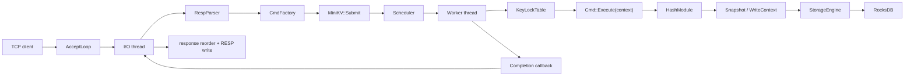

# MiniKV Architecture Audit

## Background And Scope

This document captures the current implementation state of `minikv/` in this
repository. It summarizes how the code is structured today, how requests flow
through the system, what storage model is in use, and which architectural risks
are already visible from the implementation.

The scope is limited to `minikv/` itself. It does not attempt to document the
whole RocksDB codebase.

Related documents:

- [README.md](./README.md)
- [getting-started.md](./getting-started.md)
- [build.md](./build.md)
- [layers/facade.md](./layers/facade.md)
- [layers/server.md](./layers/server.md)
- [layers/command.md](./layers/command.md)
- [layers/worker.md](./layers/worker.md)
- [layers/engine.md](./layers/engine.md)

## Module Layering

The current implementation is organized around a search-prep kernel split:

`main -> Server -> RESP parser / CmdFactory -> MiniKV -> Scheduler -> Worker -> CommandContext -> HashModule -> Snapshot / WriteContext -> StorageEngine -> RocksDB`

The responsibilities are:

- `src/main.cc`: parses process flags, opens `MiniKV`, starts the TCP server.
- `include/minikv/minikv.h` and `src/minikv.cc`: public facade that owns the
  shared scheduler, storage engine, hash module, and the current no-op mutation
  hook.
- `src/server/`: TCP accept loop, per-I/O-thread connection management, RESP
  parsing, response encoding, and response reordering.
- `src/command/`: converts parsed command parts or compatibility
  `CommandRequest` values into registered `Cmd` objects and executes supported
  commands against `CommandContext`.
- `src/kernel/`: scheduler, storage engine, snapshot, write context, command
  registry, reply helpers, and mutation hook interfaces.
- `src/types/hash/`: current hash semantics built on top of storage primitives.
- `src/worker/`: worker queue and same-key serialized command execution.

Public behavior is intentionally narrow today:

- Supported commands: `PING`, `HSET`, `HGETALL`, `HDEL`
- Supported data type: hash only
- Supported deployment shape: single process, POSIX server path

## Request Lifecycle

The request path is split into network I/O, keyed execution, and typed storage
semantics:

1. `Server::AcceptLoop()` accepts client sockets and assigns them to an I/O
   thread in round-robin fashion.
2. Each I/O thread polls its own connections, reads bytes, appends into the
   per-connection read buffer, and uses `RespParser` to extract one or more RESP
   arrays.
3. Parsed parts are converted into a concrete `Cmd` by `CmdFactory`.
4. `Server` assigns a per-connection request sequence and submits the task into
   `MiniKV::Submit()`.
5. `MiniKV` forwards that task into the shared `Scheduler`.
6. `Scheduler` picks a worker queue with round-robin plus ring probing.
7. The worker thread acquires the striped key lock for `cmd->RouteKey()` and
   executes `Cmd::Execute(context)`.
8. Hash commands use `HashModule`, which reads through `Snapshot` and writes
   through `WriteContext`.
9. `StorageEngine` translates those primitive operations onto RocksDB column
   families and write batches.
10. The completion callback pushes the `CommandResponse` back into the owning
    I/O thread's completed queue.
11. The I/O thread reorders completions by request sequence, encodes the
    response as RESP, and appends it to the connection's write buffer.
12. The I/O thread flushes buffered responses back to the client socket.

This split makes two previously entangled concerns explicit:

- keyed execution serialization
- multi-column-family consistent reads

## Storage Model

`StorageEngine` opens RocksDB with three column families:

- `default`: opened because RocksDB requires it, but it is not part of the
  active data model.
- `meta`: stores per-user-key metadata.
- `hash`: stores hash field/value pairs.

The data layout is still driven by `KeyCodec`:

- Meta key: `m| + key_length + user_key`
- Hash data key prefix: `h| + key_length + user_key + version`
- Hash data key: `hash_prefix + field`

The metadata payload currently contains:

- `type`
- `encoding`
- `version`
- `size`
- `expire_at_ms`

Current behavior:

- `HashModule::PutField()` loads metadata and field existence through one
  `Snapshot`, updates metadata in one `WriteContext`, and invokes the hook
  call site before commit.
- `HashModule::ReadAll()` loads metadata and scans the `hash` column family
  through one `Snapshot`.
- `HashModule::DeleteFields()` loads metadata and field existence through one
  `Snapshot`, deletes field keys and updates or removes metadata through one
  `WriteContext`, and invokes the hook call site before commit.

This is still a compact hash-only model, but the layers are now ready for
future storage consumers that need read consistency without reusing hash
semantics.

## Concurrency Model

The concurrency design is still based on keyed serialization:

- Connections are owned by I/O threads.
- Command execution is owned by worker threads.
- Requests are load-balanced across worker queues.
- Requests for the same key serialize on one striped mutex derived from
  `RouteKey()`.

What changed is where those guarantees live:

- `Scheduler` owns admission control, worker fan-out, and metrics.
- `KeyLockTable` still provides same-key serialization.
- `Snapshot` provides the multi-column-family read-consistency contract for
  logical hash reads.

Benefits of this model:

- Same-key updates avoid explicit coordination inside the hash module.
- Multi-column-family reads no longer depend on ad hoc read ordering.
- Network progress is decoupled from RocksDB calls.
- Different keys can execute in parallel across workers.
- Same-connection response order is preserved by the server reorder buffer.

Limits of this model:

- Correctness is still intentionally single-key scoped.
- Stripe collisions can serialize unrelated keys.
- Cross-key request semantics are still not atomic.
- Reads are consistent within one logical hash operation, not across arbitrary
  multi-command workflows.

## Architecture Audit

### P1: Public API And Internal Results Are Still RESP-Shaped

`MiniKV` still exposes typed helpers such as `HSet()` and generic command
execution via `Execute()` and `Submit()`. `CommandResponse` is still close to
RESP instead of being a transport-neutral domain result.

Impact:

- The library interface is not clearly separated from the wire protocol.
- Embedding `MiniKV` in a non-RESP environment would still pull in
  command-oriented result shaping.

Recommended follow-up:

- Separate storage/domain results from RESP transport formatting if `minikv`
  grows beyond the current server-oriented prototype.

### P2: Mutation Hook Exists Only As An Empty Extension Point

`MutationHook` now exists and receives logical hash mutations plus the active
`WriteContext`, but the only implementation is `NoopMutationHook`.

Impact:

- The write path is structurally ready for Search or other secondary effects,
  but there is no current behavior behind that interface.
- It is easy to overread the existence of the hook as evidence that indexing or
  module behavior already exists.

Recommended follow-up:

- Keep hook contracts minimal and explicit until real secondary-write behavior
  is attached.

### P2: Metadata Schema Still Signals Future Features That Are Not Active

The metadata contains `version` and `expire_at_ms`, but the current hash
implementation still uses `version = 1`, never rolls the version forward, and
never enforces TTL.

Impact:

- Readers can still infer capabilities that do not exist yet.
- Future maintainers may assume version-based invalidation or expiration is
  already wired through the kernel when it is not.

Recommended follow-up:

- Either document these fields as reserved-for-future-use only, or complete the
  missing lifecycle semantics before relying on them in higher layers.

### P3: Server Extensibility And Operability Are Still Minimal

The server still uses a hand-rolled `poll` loop plus wakeup pipes. That is
acceptable for a compact prototype, but the operational surface is still thin:

- no built-in metrics endpoint
- wakeup writes are ignored
- no structured shutdown/reporting path beyond thread termination

Recommended follow-up:

- Add exported observability before treating the transport layer as production
  capable.
